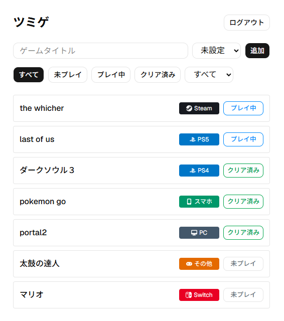

# 積みゲートラッカー（ツミゲ）

> 持っているゲームと進行状況（未プレイ / プレイ中 / クリア済み）を一元管理する Web アプリ。

「買ったのに遊んでいないゲーム（＝積みゲー）」を見える化し、何を持っていて何が手つかずかを把握できるようにします。

## スクリーンショット



## ライブデモ

🔗 **https://tsumige-tracker.vercel.app/**

> ※ ログインが必要です。手元で動かすには Supabase のキー設定が必要なため、動作を試す場合はライブデモの利用を推奨します。

## なぜ作ったか

ゲームをセールでつい買ってしまい、遊ばないまま「積んで」いく。手元に何があり、どれが未プレイなのかを把握できず、似たものを重ねて買ってしまう——という自分自身の困りごとがきっかけです。

Steam などストア内にはライブラリ機能がありますが、**Switch・PS5・各ストアの独占タイトルをまたいで一元管理する**のは難しいのが現状です。そこで、プラットフォームを横断して「持っているゲームと進行状況」をまとめられる専用アプリを作りました。

## 実装済み機能

- **ユーザー認証**（Supabase Auth）
- **ゲームの追加・編集・削除**（行クリックでモーダルを開き操作）
- **ステータス管理**：バッジをクリックで「未プレイ → プレイ中 → クリア済み」を切り替え
- **ステータスで絞り込み**：フィルターボタンで一覧を絞り込み（選択中を強調表示）
- **プラットフォーム別の管理**：ゲームごとに機種（Switch / PS5 / Steam など）を設定し、ドロップダウンで絞り込み。ステータスとの併用にも対応

## 今後の展望

- 重複購入の警告
- 積み本数・クリア率などの統計表示

> 実装が完了した項目は順次「実装済み機能」へ移していきます。

## 技術スタック

| 技術                                    | 選定理由                                                                                                             |
| --------------------------------------- | -------------------------------------------------------------------------------------------------------------------- |
| React                                   | コンポーネント分割で UI を部品化する設計を学ぶため                                                                   |
| Vite                                    | 高速な開発体験。設定が軽い                                                                                           |
| Supabase                                | 認証＋データベースを一つで完結。バックエンドを自前実装せず本質に集中でき、基本無料で使える                           |
| Tailwind CSS + shadcn/ui                | モダンな見た目を素早く整えるため                                                                                     |
| ESLint + Prettier + husky + lint-staged | コミット時に自動で整形・検査し、品質を担保する                                                                       |
| JavaScript（TypeScript 未使用）         | まず JavaScript の基礎を固めるためあえて JS で実装。習得後に TypeScript へ移行予定で、その移行過程も学びと捉えている |

## 工夫した点 / 学んだこと

- **コンポーネント分割による責務分け**：1ファイルに詰め込まず、`GameCard`・`GameModal`・`Header` に切り出し。「データ操作はページ、見た目は部品」で整理した
- **状態から UI を計算する設計**：フィルターを `useState` ＋ 配列 `.filter()` でクライアント側処理し、DB 通信なしで即座に絞り込み。選択中ボタンの見た目も状態から計算している
- **shadcn/ui の導入**：UI コンポーネントライブラリを導入し、モダンな見た目を構築した
- **品質担保の仕組み化**：ESLint + Prettier を husky + lint-staged と組み合わせ、コミット時に自動整形・検査が走るようにした
- **React での開発を実践**：自分でコードを読み書きしながら、React の状態管理とコンポーネント設計を習得した

## セットアップ

```bash
git clone https://github.com/IKcoding-jp/tsumige-tracker.git
cd tsumige-tracker
npm install

# .env.local を作成し、Supabase の URL と ANON KEY を設定
# VITE_SUPABASE_URL=...
# VITE_SUPABASE_ANON_KEY=...

npm run dev
```

> Supabase のキーが無いとログインできないため、動作確認はライブデモ（Vercel）の利用を推奨します。

## 備考

個人開発のプロジェクトです。React と Supabase を実際のプロダクトで習得することを兼ねて制作しています。
